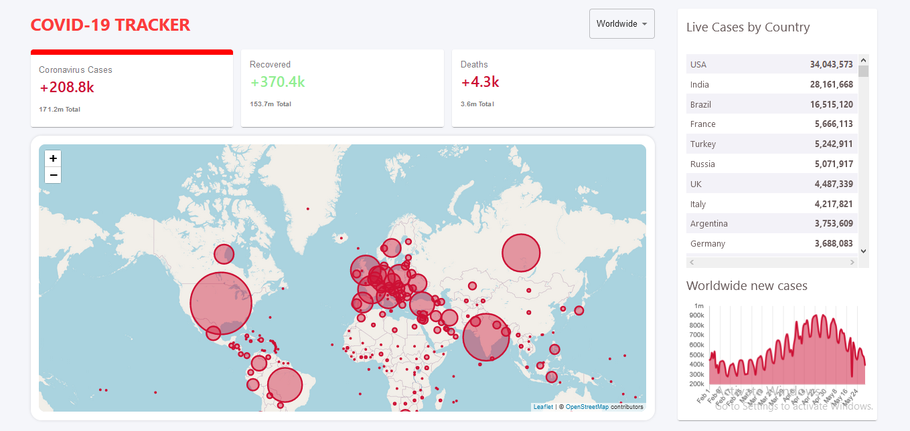

# COVID-19-TRACKER

 

### 1. Firebase link of this project
### 2. [Key Features](#key-features) 
### 3. [Technologies I've used](#technologies-ive-used)
 

## Firebase link of this project:  
   ### See the project here >>>👉   https://covid-19-tracker-e5754.web.app/

## Key Features:
    1. We can see total number of cases, total recovered cases and total number of deaths
       worldwide and also in a specific country, from the box.
       
    2. From the table we can see the ranking of each country based on the total cases.
    
    3. By clicking any country from the map we can get the clear visualization of 
       corona scenario of that specific nation.
       
    4. From the chart line graph we can get the clear data visualization of total cases,
       total recoveries and total deaths.
  
   
  
  ### Mobile Responsiveness
  
   
    

  **[⬆ Back to Top](#covid-19-tracker)**

## Technologies I've used:
    1. react => Entire front-end design of this app is made by Reactjs.
    
    2. The API I have used is "disease.sh".
    
    3. material-UI => I've used Material-UI to style this application.
    
    4. react-chartjs => to build the chart graphical representation.
    
    5. numeral => for tooltip, when we hover on the graph, we can get the value on that point.
    
    6. react-leaflet => to build the map.
    
    7. firebase => to deploy the app
    
    
  **[⬆ Back to Top](#covid-19-tracker)**
